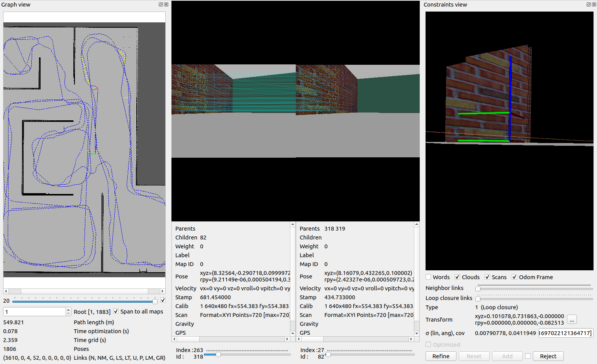

# Where Am I

```bash
cd project04

cd src
catkin_init_workspace

cd ..
catkin_make
source devel/setup.zsh

roslaunch my_robot world.launch
roslaunch my_robot amcl.launch

rosrun teleop_twist_keyboard teleop_twist_keyboard.py
```

