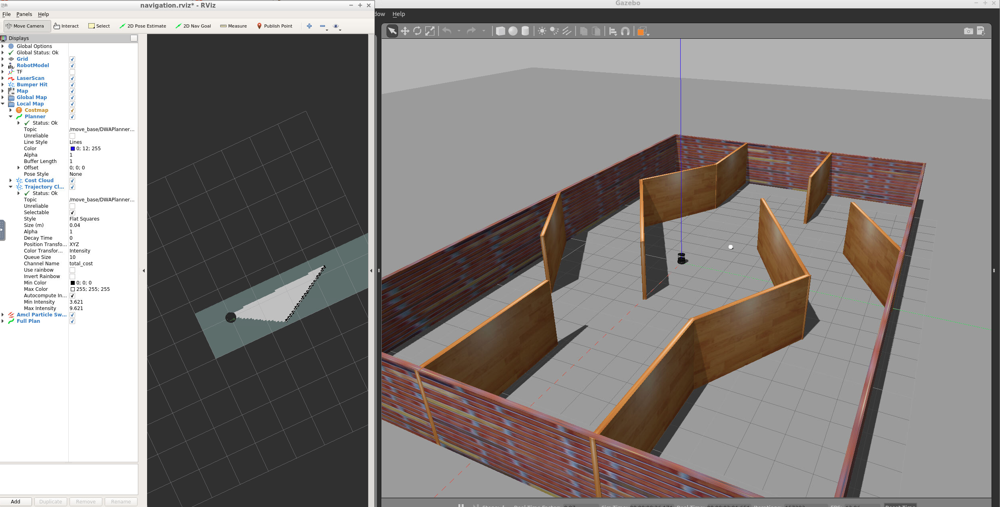
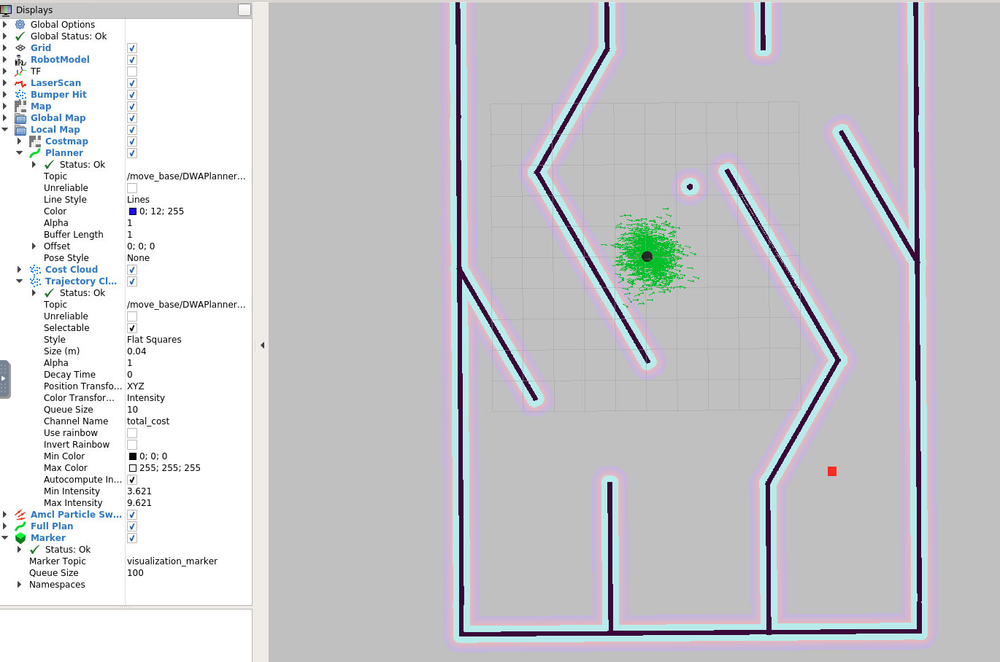

# Home Service Robot

> !!! This project has been only tested in a specific environment:
> - OS: Ubuntu 16.04.6 LTS
> - ROS: kinetic


## Sync Submodules
Please make sure to load submodules

```bash
git submodule update --init --recursive
```


## Setup

```bash
cd project05

cd src
catkin_init_workspace

cd ..
catkin_make
source devel/setup.bash

```

## Scripts

### Test SLAM

`test_slam.sh` will deploy a turtlebot inside the environment, you can control it with keyboard commands, interface it with a SLAM package, and visualize the map in rviz.

```bash
./src/scripts/test_slam.sh
```


### Localization and Navigation Testing

The ROS navigation stack permits your robot to avoid any obstacle on its path by re-planning a new trajectory once your robot encounters them. You can send a specific goal for your robot to reach while localizing itself with AMCL.

```bash
./src/scripts/test_navigation.sh
```


### Reaching Navigation Goals

The robot travels to the desired pickup zone, displays a message that it reached its destination, waits 5 seconds, travels to the desired drop off zone, and displays a message that it reached the drop off zone.

```bash
./src/scripts/pick_objects.sh
```


### Add Virtual Objects

The marker should initially be published at the pickup zone. After 5 seconds it should be hidden. Then after another 5 seconds it should appear at the drop off zone.

```bash
./src/scripts/add_markers.sh
```



### Home Service Robot Demo

- Initially show the marker at the pickup zone.
- Hide the marker once your robot reach the pickup zone.
- Wait 5 seconds to simulate a pickup.
- Show the marker at the drop off zone once your robot reaches it.

```bash
./src/scripts/home_service.sh
```
